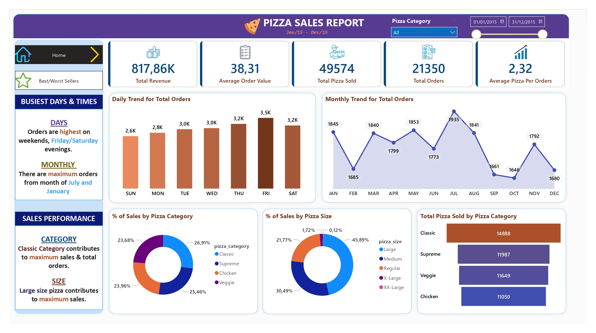
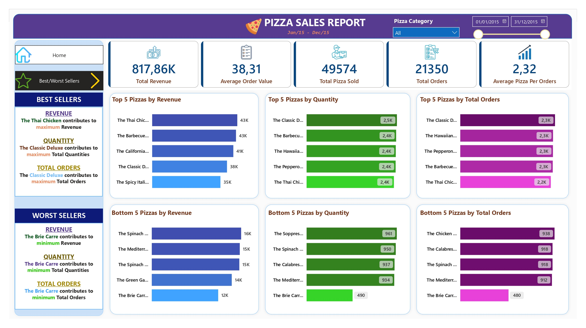

# Pizza Sales Dashboard (Power BI)

Full end-to-end Business Intelligence analysis based on one year of sales data from a fictional pizzeria.
Demonstrates a complete BI workflow: SQL data preparation, KPI definition, and interactive dashboard design in Power BI.

## Project Overview

One year of pizza sales analyzed to deliver clear business insights:

- Revenue performance
- Customer ordering behavior
- Best-selling and worst-selling products
- Sales trends by day, month, category, and size
- Operational KPIs for decision-making

## Technologies

- **Power BI Desktop** — data modeling, DAX, dashboard design
- **PostgreSQL** — database creation, SQL queries, KPI calculations
- **Excel/CSV** — source dataset

## Key KPIs

Computed using SQL and Power BI DAX:

- Total Revenue · Total Orders · Total Pizzas Sold
- Average Order Value · Average Pizzas per Order
- Top 5 Best-Selling Pizzas / Top 5 Worst-Selling Pizzas
- Revenue by Category and Size
- Orders by Day and Month

```sql
-- Total Revenue
SELECT SUM(total_price) AS total_revenue FROM pizzas;

-- Average Order Value
SELECT SUM(total_price) / COUNT(DISTINCT order_id) AS avg_order_value FROM pizzas;
```

## Business Insights

- **Classic and Supreme** pizzas generate the highest revenue, driven by strong demand and higher unit prices
- **Large and Medium** sizes dominate sales, reflecting customer preference for value-oriented portions
- **Fridays and weekends** show peak order volume — leisure-driven consumption pattern
- Monthly trends reveal seasonal fluctuations useful for staffing and inventory planning

## Dashboard Preview

### Home page



### Best Sellers



## Power BI File

The full report is available at `/powerbi/pizza_dashboard.pbix` — open with Power BI Desktop.
